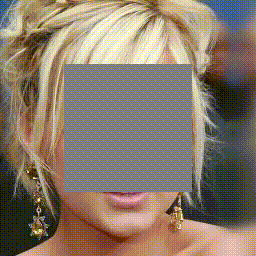

<br>

# Pluralistic Image Completion

This repository implements the training and testing for "Pluralistic Image Completion" by Chuanxia Zheng, [Tat-Jen Cham](http://www.ntu.edu.sg/home/astjcham/) and [Jianfei Cai](http://www.ntu.edu.sg/home/asjfcai/) at NTU. The repository offers the original implementation of the paper in pytorch.
- Example


Example completion results of our method on images of a face, natural scenes, a building and a dog with various masks (masks shown in gray). For each group, the masked input image is shown left, followed by sampled results from our model without any post-processing. The results are diverse and plusible. The details can be viewed by zooming in.

# Getting Started
## Installation
This code was tested with Pytoch 0.4.0, CUDA 8.0, Python 3.6 and Ubuntu 16.04

- Install Pytoch 0.4, torchvision, and other dependencies from [http://pytorch.org](http://pytorch.org)
- Install python libraries [visdom](https://github.com/facebookresearch/visdom) and [dominate](https://github.com/Knio/dominate) for visualization

```
pip install visdom dominate
```
- Clone this repo:

```
git clone https://github.com/lyndonzheng/Pluralistic
cd Synthetic2Realistic
```

## Datasets
The face dataset comes from [CelebA](http://mmlab.ie.cuhk.edu.hk/projects/CelebA.html) and use the algorithm of [Growing GANs](https://github.com/tkarras/progressive_growing_of_gans) to get the high-resolution CelebA-HQ dataset. The building dataset comes from [Paris](https://github.com/pathak22/context-encoder), natural scenery comes from [Places2](http://places2.csail.mit.edu/) and object comes from [ImageNet](http://www.image-net.org/).

## Training
- Train a model with datasets:

```
python train.py --name celeba_random --img_file ./dataset/image_painting/celeba_train.txt --flip --augment --shuffle
```

- To view training results and loss plots, run python -m visdom.server and copy the URL [http://localhost:8097](http://localhost:8097).
- Training results will be saved under the *checkpoints* folder. The more training options can be found in *options*.

## Testing

- Test the model

```
python test.py  --name celeba_random --img_file ./dataset/image_painting/celeba_test.txt
--results_dir ./dataset/image_painting/results/ours/celeba/ --mask center_mask
```
- If test random mask, you need to provide the mask file_path

## pretrained Models

Download the model dirs and put it under ```checkpoints/```. Run testing or continue_train as described above. All models are trained with images of resolution 256x256 and with center holes 128x128 and random holes of arbitrary sizes.

## License

## Citation
