# Pluralistic Image Completion
[ArXiv](https://arxiv.org/abs/1903.04227) | [Project Page](http://www.chuanxiaz.com/publication/pluralistic/) | [Online Demo](http://www.chuanxiaz.com/project/pluralistic/) | [Video(demo)](https://www.youtube.com/watch?v=9V7rNoLVmSs)
<br>

This repository implements the training, testing and editing tools for "Pluralistic Image Completion" by [Chuanxia Zheng](http://www.chuanxiaz.com), [Tat-Jen Cham](http://www.ntu.edu.sg/home/astjcham/) and [Jianfei Cai](http://www.ntu.edu.sg/home/asjfcai/) at NTU. Given one masked image, the proposed **Pluralistic** model is able to generate *multiple* and *diverse* plausible results with various structure, color and texture.

## Editing example


## Example results

<table>
<tr>
<td>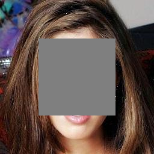</td>
<td>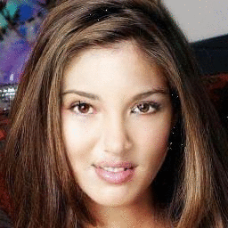</td>
<td>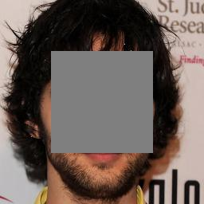</td>
<td>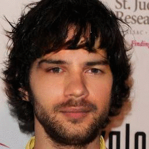</td>
</tr>

<tr>
<td>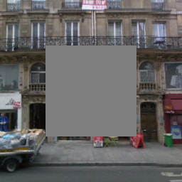</td>
<td>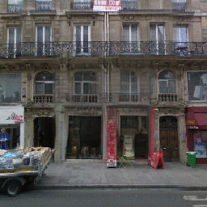</td>
<td>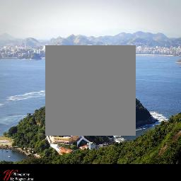</td>
<td>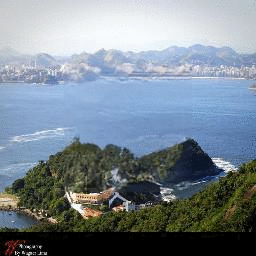</td>
</tr>

</table>

Example completion results of our method on images of face ([CelebA](http://mmlab.ie.cuhk.edu.hk/projects/CelebA.html)), building ([Paris](https://github.com/pathak22/context-encoder)), and natural scenes ([Places2](http://places2.csail.mit.edu/)) with center masks (masks shown in gray). For each group, the masked input image is shown left, followed by sampled results from our model without any post-processing. The results are diverse and plusible.

## [More results on project page](http://www.chuanxiaz.com/publication/pluralistic/)

# Getting started
## Installation
This code was tested with Pytoch 0.4.0, CUDA 9.0, Python 3.6 and Ubuntu 16.04

- Install Pytoch 0.4, torchvision, and other dependencies from [http://pytorch.org](http://pytorch.org)
- Install python libraries [visdom](https://github.com/facebookresearch/visdom) and [dominate](https://github.com/Knio/dominate) for visualization

```
pip install visdom dominate
```
- Clone this repo:

```
git clone https://github.com/lyndonzheng/Pluralistic
cd Pluralistic
```

## Datasets
- ```face dataset```: 24183 training images and  2824 test images from [CelebA](http://mmlab.ie.cuhk.edu.hk/projects/CelebA.html) and use the algorithm of [Growing GANs](https://github.com/tkarras/progressive_growing_of_gans) to get the high-resolution CelebA-HQ dataset
- ```building dataset```: 14900 training images and 100 test images from [Paris](https://github.com/pathak22/context-encoder)
- ```natural scenery```: original training and val images from [Places2](http://places2.csail.mit.edu/)
- ```object``` original training images from [ImageNet](http://www.image-net.org/).

## Training
- Train a model (**default**: random irregular and irregular holes):

```
python train.py --name celeba_random --img_file your_image_path
```
- Set ```--mask_type``` in options/base_options.py for different training masks. ```--mask_file``` path is needed for **external irregular mask**, such as the irregular mask dataset provided by [Liu et al.](http://masc.cs.gmu.edu/wiki/partialconv) and [Karim lskakov ](https://github.com/karfly/qd-imd).
- To view training results and loss plots, run ```python -m visdom.server``` and copy the URL [http://localhost:8097](http://localhost:8097).
- Training models will be saved under the **checkpoints** folder.
- The more training options can be found in **options** folder.

## Testing

- Test the model

```
python test.py  --name celeba_random --img_file your_image_path
```
- Set ```--mask_type``` in options/base_options.py to test various masks. ```--mask_file``` path is needed for **3. external irregular mask**,
- The default results will be saved under the *results* folder. Set ```--results_dir``` for a new path to save the result.

## Pretrained Models
Download the pre-trained models using the following links and put them under```checkpoints/``` directory.

- ```center_mask model```: [CelebA_center](https://drive.google.com/open?id=1zQnFkRAtjGCorOd0Mj9tfdApcAPbs6Kw) | [Paris_center](https://drive.google.com/open?id=1s4zmYhJAdkRErivj3OuTPeQ5ECQtq35e) | [Places2_center](https://drive.google.com/open?id=1y8wE8wcIq8EMRzjgOE3Y_Bv4iPLW4RV3) | [Imagenet_center](https://drive.google.com/open?id=1iH60vWygjk2Gc9iyVAva45vz3meSeZPg)
- ```random_mask model```: [CelebA_random](https://drive.google.com/open?id=1nLq-W7eAZErqsvB1Q8h1yQT_l7_kZBXT) | [Paris_random](https://drive.google.com/open?id=1D67Y1AtsMy_opysxtt06D7vZrDUKvDAm) | [Places2_random](https://drive.google.com/open?id=1L4NAHQqyEJ_ANt4SfEP1hdEVdGrteu4L) | [Imagenet_random](https://drive.google.com/open?id=1hS6D4gjOkvEOlAEOAKxCCzjhpCoddU2S)

Our main novelty of this project is the *multiple* and *diverse* plausible results for one given masked image. The **center_mask models** are trained with images of resolution 256*256 with center holes 128x128, which have large diversity for the large missing information. The **random_mask models** are trained with random regular and irregular holes, which have different diversity for different mask sizes and image backgrounds.

## GUI
Download the pre-trained models from [Google drive](https://drive.google.com/open?id=1lPSKKVy99ECpwzpN3EExdeBxhexwjJEh) and put them under```checkpoints/``` directory.

- Install the [PyQt5](https://pypi.org/project/PyQt5/) for GUI operation

```
pip install PyQt5
```

Basic usage is:
```
python -m visdom.server
python ui_main.py
```

The buttons in GUI:
- ```Options```: Select the model and corresponding dataset for editing.
- ```Bush Width```: Modify the width of bush for free_form mask.
- ```draw/clear```: Draw a ```free_form``` or ```rectangle``` mask for random_model. Clear all mask region for a new input.
- ```load```: Choose the image from the directory.
- ```random```: Random load the editing image from the datasets.
- ```fill```: Fill the holes ranges and show it on the right.
- ```save```: Save the inputs and outputs to the directory.
- ```Original/Output```: Switch to show the original or output image.

The steps are as follows:
```
1. Select a model from 'options'
2. Click the 'random' or 'load' button to get an input image.
3. If you choose a random model, click the 'draw/clear' button to input free_form mask.
4. If you choose a center model, the center mask has been given.
5. click 'fill' button to get multiple results.
6. click 'save' button to save the results.
```

## Editing Example Results
- **Results (original, input, output) for object removing**

<table>
<tr>
<td>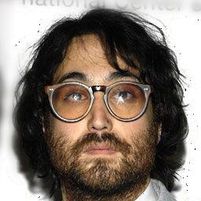</td>
<td>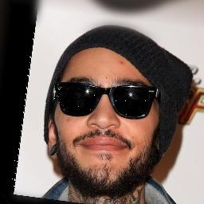</td>
<td>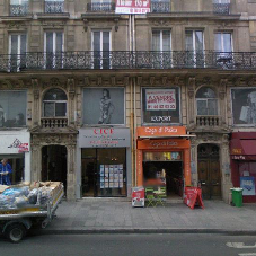</td>
<td></td>
</tr>

<tr>
<td>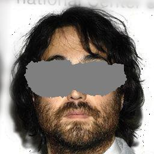</td>
<td>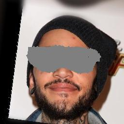</td>
<td>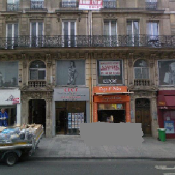</td>
<td></td>

</tr>


<tr>
<td>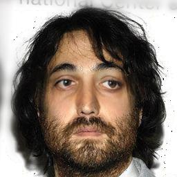</td>
<td>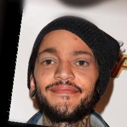</td>
<td>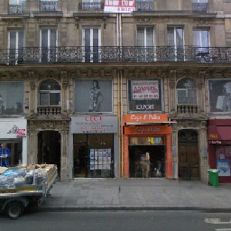</td>
<td></td>
</tr>

</table>

- **Results (input, output) for face playing.** When mask half or right face, the diversity will be small for the short+long term attention layer will copy information from other side. When mask top or down face, the diversity will be large.

<table>
<tr>
<td>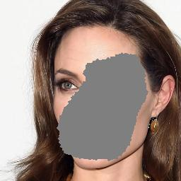</td>
<td>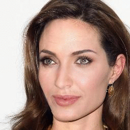</td>
<td>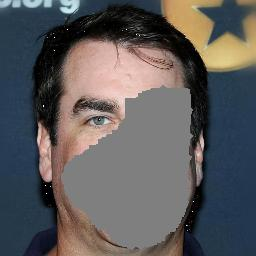</td>
<td>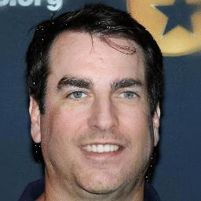</td>
</tr>

<tr>
<td>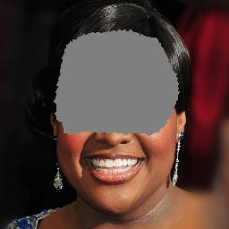</td>
<td>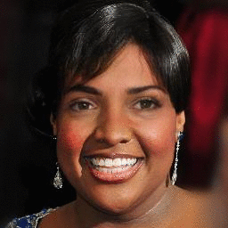</td>
<td>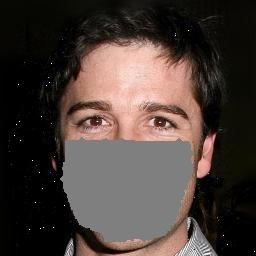</td>
<td>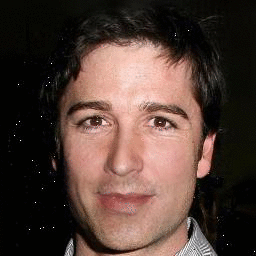</td>
</tr>

<tr>
<td>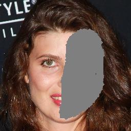</td>
<td>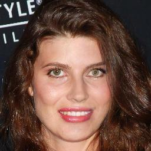</td>
<td>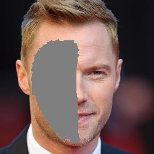</td>
<td>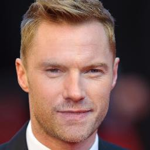</td>
</tr>


</table>

## Next

- Free form mask for various Datasets
- Higher resolution image completion

## License
<br />This work is licensed under a <a rel="license" href="http://creativecommons.org/licenses/by-nc/4.0/">Creative Commons Attribution-NonCommercial 4.0 International License</a>.

This software is for educational and academic research purpose only. If you wish to obtain a commercial royalty bearing license to this software, please contact us at chuanxia001@e.ntu.edu.sg.

## Citation

If you use this code for your research, please cite our paper.
```
@inproceedings{zheng2019pluralistic,
  title={Pluralistic Image Completion},
  author={Zheng, Chuanxia and Cham, Tat-Jen and Cai, Jianfei},
  booktitle={Proceedings of the IEEE Conference on Computer Vision and Pattern Recognition},
  pages={1438--1447},
  year={2019}
}

@article{zheng2021pluralistic,
  title={Pluralistic Free-From Image Completion},
  author={Zheng, Chuanxia and Cham, Tat-Jen and Cai, Jianfei},
  journal={International Journal of Computer Vision},
  pages={1--20},
  year={2021},
  publisher={Springer}
}
```
